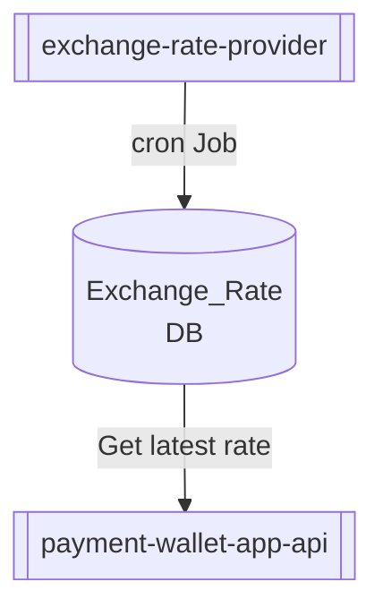

# PAYMENT-WALLET-APP

## PAYMENT-API-SERVICE
* To make payment.
* Project Path: [payment-wallet-app-api](payment-wallet-app-api)

## EXCHANGE-RATE-PROVIDER-SERVICE
* To make smooth money conversion.
* Project Path: [exchange-rate-provider](exchange-rate-provider)

### Here is the relation diagram between both service:

## References:
* [mermaid](http://mermaid.js.org/intro/)